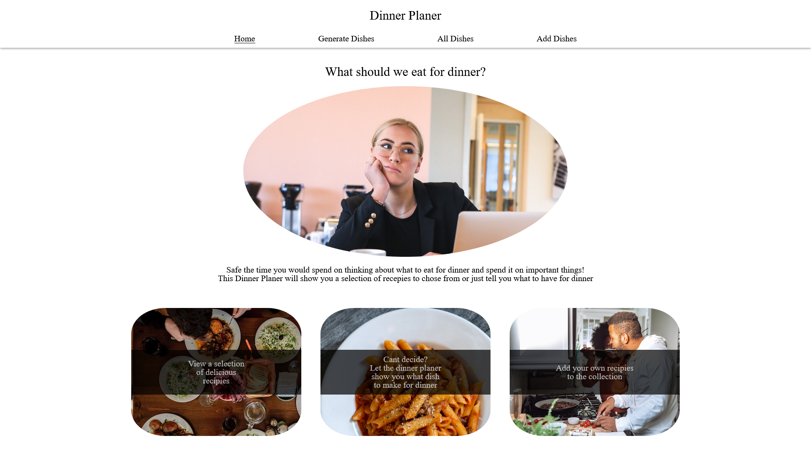
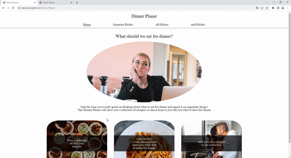

<h1 align="center">Dinner Planer</h1>

## Short Description
----
This Website is not finished yet and there are alot of things that will be improved or added later on, especially the visuals. See the List of planed improvements. The Website still can help you overcome the struggle of figuring out what to eat for Dinner. On This Website you can add recipes to the collection, view all recipes in the collection and let the website show you a random dish from the collection. If you dont know what to eat for dinner, you simply let the website show you a random dish from the collection with the necessary ingredients and you make that recipe for dinner.

## Live page
---
Click the link to see the [live page](https://dannyruda.github.io/Dinner-Planer/)

## Demo Video
---

Showcases some example features

## Motivation
---
The goal of this project was to practice the use of webpack and npm together with ES6 modules and to build a website with multiple tabs using those technologies. Webpack should used to bundle the modules from a src folder to a single main.js file in a dist folder and also automatically create an index.html file with everything linked in the order they need to be loaded. Additionally the used images should also be optimized and transfered from the src folder into the dist folder. During the project i also got the idea to solve a personal problem of mine. I wanted to build a website where i can store my personal recipes and let the website tell me what to cook for dinner with showing me a random dish or recipe from the collection. During the brainstorming for that idea, i also wanted to learn how the user can upload an image and how i can use the localStorage to store my recipes so they survive even amongst sessions.

## Features
---
- Multiple Tabs or menu points
- Add your own Recipes to the collection
- Remove recipes from the collection
- Browse all recipes in the collection
- Show the full recipe with ingredients and steps when clicking on a recipe in the all dishes tab
- Let the Website show you a random dish from the collection in the Generate Dish tab
- Doesn't show you the same dish twice unless there is only one dish in the collection
- Each Tabs logic is writen in its own javascript file/module and bundled using webpack

## Technologies used
---
- JavaScript
- CSS3
- HTML 5
- Webpack

## Future Improvements
---
- Overall Design
- Design and layout of the recipes cards
- Design and layout of the recipes previews in the All Dishes tab
- make image upload for own recipes work with asynchronus functions
- allow editing a recipe 
- Make it possible to enter ingredients in the Generate Dish tab so that the randomly shown recipe will contain all entered ingredients to get a dish that will use your leftovers

## License
---
MIT License

Copyright (c) [2022] [DannyRuda]

Permission is hereby granted, free of charge, to any person obtaining a copy
of this software and associated documentation files (the "Software"), to deal
in the Software without restriction, including without limitation the rights
to use, copy, modify, merge, publish, distribute, sublicense, and/or sell
copies of the Software, and to permit persons to whom the Software is
furnished to do so, subject to the following conditions:

The above copyright notice and this permission notice shall be included in all
copies or substantial portions of the Software.

THE SOFTWARE IS PROVIDED "AS IS", WITHOUT WARRANTY OF ANY KIND, EXPRESS OR
IMPLIED, INCLUDING BUT NOT LIMITED TO THE WARRANTIES OF MERCHANTABILITY,
FITNESS FOR A PARTICULAR PURPOSE AND NONINFRINGEMENT. IN NO EVENT SHALL THE
AUTHORS OR COPYRIGHT HOLDERS BE LIABLE FOR ANY CLAIM, DAMAGES OR OTHER
LIABILITY, WHETHER IN AN ACTION OF CONTRACT, TORT OR OTHERWISE, ARISING FROM,
OUT OF OR IN CONNECTION WITH THE SOFTWARE OR THE USE OR OTHER DEALINGS IN THE
SOFTWARE.